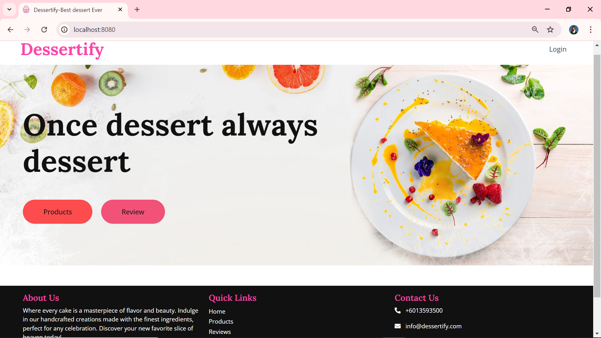
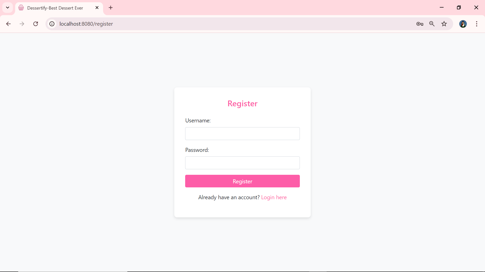
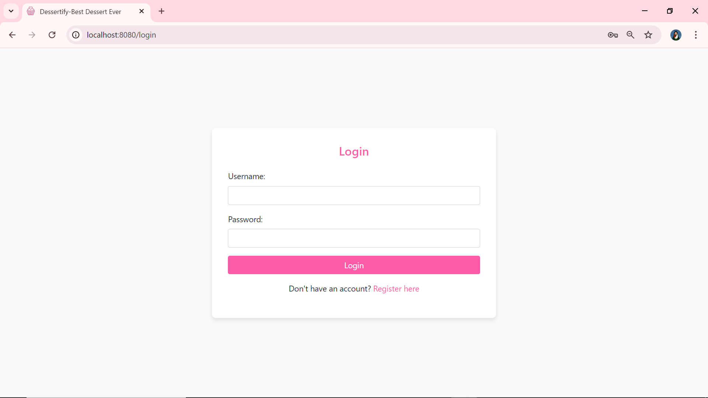
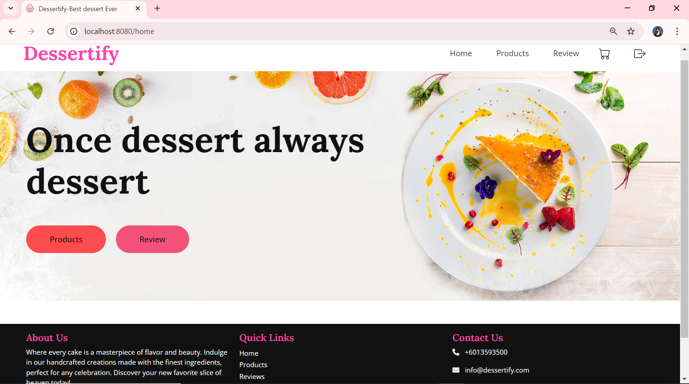
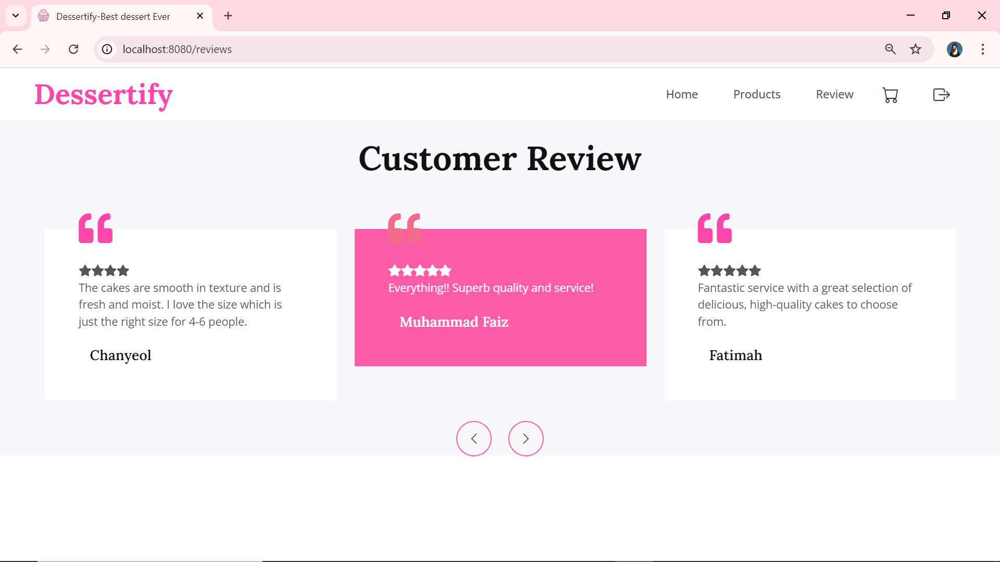
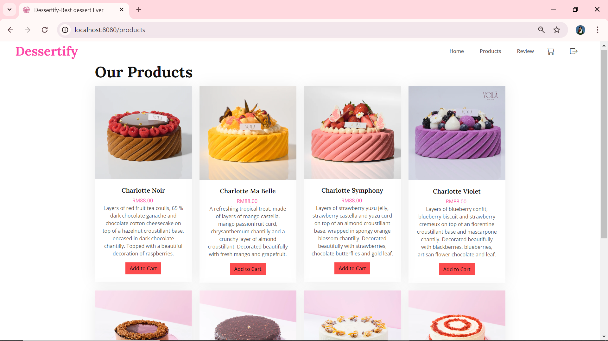
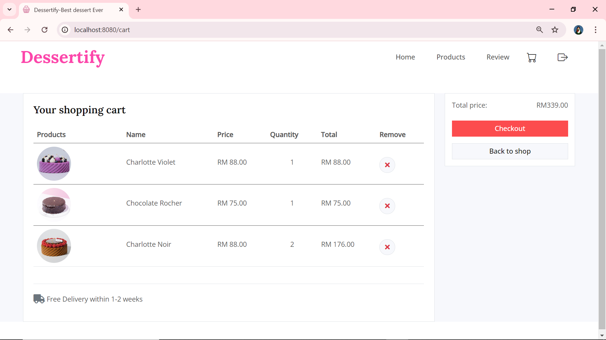
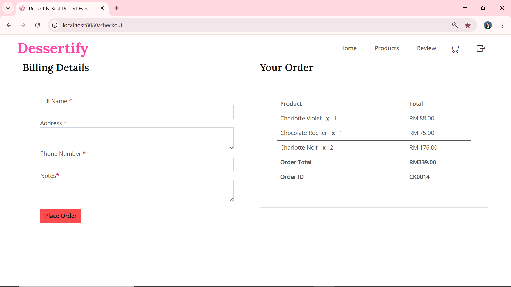
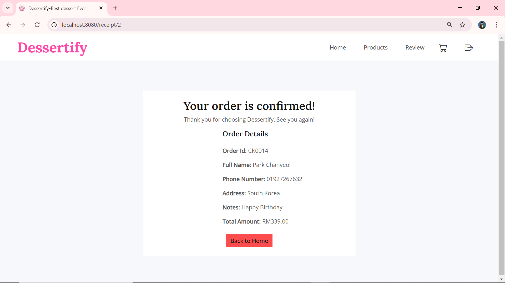

# Cake Shop E-Commerce Website

## 🎂 Overview

This project is an e-commerce website for a cake shop, built using **Java** with **Spring Boot** for the backend and **Thymeleaf** for the frontend. The application allows users to browse various cake products, add them to a shopping cart and proceed to checkout. It also includes features for customer to view shop review and order management, making it a comprehensive online shopping experience.

---

## 🚀 Features

### 🛍️ Product Display
- View available cakes with details such as **name**, **description**, **price**, and **image**.
- Users can **filter** and **search** through various categories of cakes.

### 🛒 Shopping Cart
- Add cakes to the shopping cart with the ability to update quantities or remove items.
- Cart contents are persisted even if the user leaves the site or logs out.

### 💳 Checkout Process
- Fill out **billing details** and review selected items before placing an order.
- Display of **order summary** after successful checkout.

### 📦 Order Management
- Orders are stored in the database, allowing users to view past purchases.
- Ensures that cart data is retained even post-checkout for tracking purposes.

### 🌟 Customer Reviews
- View **testimonials** from past customers for each cake product.
- Helps users make informed decisions based on other customers' experiences.

---
  
## 🛠️ Technologies Used

- **Backend**: Java, Spring Boot, MySQL
- **Frontend**: Thymeleaf, HTML, CSS, JavaScript
- **Development Tools**: IntelliJ IDEA, MySQL Workbench

---

## 📦 Version
- Java 17
- MySQL 8.0
- Maven 3.6
- Spring Boot 3.3.2

---
  
## 📸 Screenshots

Here are some screenshots that showcase the key pages of the Cake Shop E-Commerce Website:

- **🔖Index Page**: Overview of the cake shop, featuring product categories and reviews.  
  

- **📝Register Page**: A form for users to sign up and create an account.  
  

- **🔑Login Page**: The login interface where users can enter their credentials.  
  

- **🍰Home Page**: Main product display page, showing cakes with details like name, description and price.  
  

- **💬Reviews Page**: Customers can view reviews made by previous customers.  
  

- **📄Product Page**: Detailed information about cake.  
  

- **🛒Cart Page**: Users can view the items in their shopping cart, update quantities or delete. Then proceed to checkout.  
  

- **💳Checkout Page**: Users can fill out billing details, view selected items and place an order.  
  

- **🧾Receipt Page**: Order summary page showing purchase details after a successful transaction.  
  

